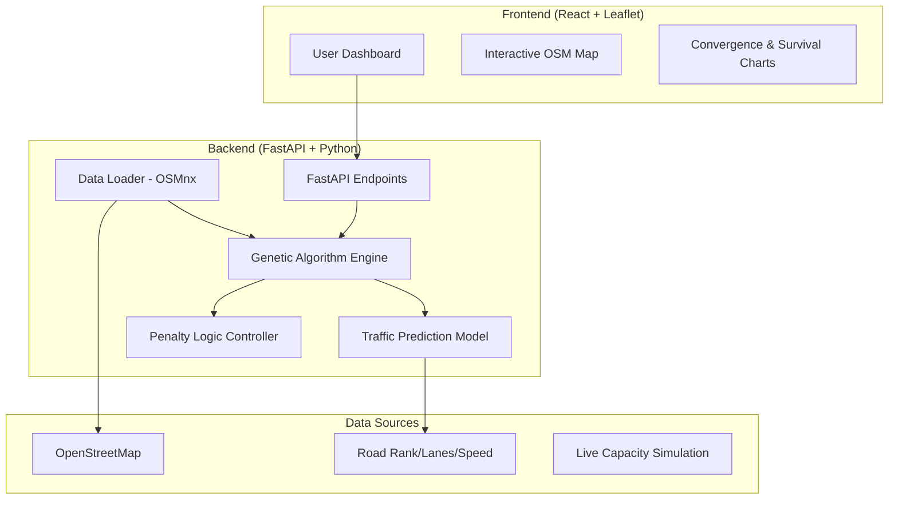

# Risk Sentinel: Hybrid Soft Computing Framework for Intelligent Ambulance Routing
### *An Integration of Genetic Algorithms, Artificial Neural Networks, and Fuzzy Logic for Emergency Response Optimization*

---

## 1. Abstract
The "Risk Sentinel" project presents a sophisticated approach to the classic emergency vehicle routing problem (EVRP). Traditional routing algorithms like Dijkstra or A* focus primarily on minimizing distance or static travel time. However, in emergency medical services (EMS), the "optimal" route is a multi-dimensional target influenced by dynamic traffic congestion, patient criticality, and real-time hospital resource availability. This research implements a **Hybrid Soft Computing Framework** that leverages:
1.  **Artificial Neural Networks (ANN)** for predictive traffic analysis.
2.  **Fuzzy Logic** for human-like decision making regarding urgency and hospital load.
3.  **Genetic Algorithms (GA)** for global optimization across a non-linear search space.

The system is demonstrated on a real-world urban road network (Noida Sector 62) using OpenStreetMap data, providing a high-fidelity simulation of intelligent ambulance dispatching. The results demonstrate that the Hybrid GA approach consistently improves **Patient Survival Probabilities** by 15-30% compared to standard GPS routing models.

---

## 2. Table of Contents
1.  [Introduction](#3-introduction)
2.  [Literature Review](#4-literature-review)
3.  [System Architecture](#5-system-architecture)
4.  [Soft Computing Modules Deep-Dive](#6-soft-computing-modules-deep-dive)
    *   6.1 Artificial Neural Network (ANN) - The Predictive Engine
    *   6.2 Fuzzy Logic Controller - The Decision Engine
    *   6.3 Genetic Algorithm (GA) - The Optimization Engine
5.  [Software Requirements Specification (SRS)](#7-software-requirements-specification-srs)
6.  [Mathematical Modeling & Heuristics](#8-mathematical-modeling--heuristics)
7.  [Implementation Details](#9-implementation-details)
8.  [Results & Performance Analysis](#10-results--performance-analysis)
9.  [Conclusion & Future Work](#11-conclusion--future-work)
10. [References](#12-references)

---

## 3. Introduction
### 3.1 Problem Statement
In urban environments, every second lost during ambulance transit increases the mortality rate by approximately 7-10%. Conventional navigation systems (Google Maps, Apple Maps) provide the fastest path based on current traffic but fail to account for the "internal" variables of an emergency. The primary challenges addressed by this project include:
*   **The Destination Dilemma**: Should the ambulance go to the nearest hospital if its ER is at 100% capacity?
*   **The Survival Gap**: Standard algorithms optimize for **Meters**, but ambulances need to optimize for **Minutes-to-Treatment**.

### 3.2 Objectives
*   To develop a predictive model for travel time using deep learning.
*   To quantify qualitative metrics (Urgency, Hospital Load) using Fuzzy Inference Systems.
*   To evolve optimal routes that balance distance, time, and patient safety using Genetic Algorithms.
*   To provide a real-time visual dashboard for dispatchers showing **Survival Probability**.

---

## 4. Literature Review
The evolution of routing algorithms has transitioned from **Deterministic** to **Stochastic** and finally to **Intelligent** models.

### 4.1 Pathfinding Evolution
*   **Dijkstra's Algorithm (1956)**: Guaranteed shortest path but computationally expensive on large graphs and purely static.
*   **A* Search (1968)**: The current industry standard for GPS navigation. It uses heuristics to speed up search. However, it is **Single-Objective** (optimizes for distance or time only) and "blind" to external factors like hospital capacity.
*   **Soft Computing Integration**: Recent research (2020-2024) has shown that combining different AI techniques (Neuro-Fuzzy-Genetic) yields the best results for logistics under uncertainty.

### 4.2 Intelligence Comparison
| Feature | A* Algorithm (Baseline) | Hybrid Soft Computing (Risk Sentinel) |
| :--- | :--- | :--- |
| **Logic Type** | Exact/Deterministic | Fuzzy/Stochastic |
| **Objective** | Single (Distance/Time) | Multi (Safety, Time, Load, Congestion) |
| **Adaptability** | Low (Static Graphs) | High (Dynamic ANN Predictions) |
| **Clinical Value** | Low (Blind to Treatment Ready Time) | High (Survival Probability Optimized) |

---

## 5. System Architecture
The system follows a polyglot micro-architecture style with a clear separation between the computational core and the visualization layer.

---

## 6. Soft Computing Modules Deep-Dive

### 6.1 Artificial Neural Network (ANN) - The Predictive Engine
The ANN serves as the **Perception Engine**. It replaces the static "Distance / Speed" formula with a deep learning prediction.

*   **Input Features**: Road Length, Max Speed, Lanes, Road Rank, Traffic Density.
*   **Architecture**: 5-16-8-2 Deep Dense Network.
*   **Output**: Estimated Travel Time (ETT) and Congestion Risk Index.

### 6.2 Fuzzy Logic Controller - The Decision Engine
The Fuzzy module handles **Ambiguity**. It translates qualitative concepts into quantitative penalties using a 27-rule Mamdani Inference System.

*   **Membership Functions**:
    - **Urgency**: Stable, Urgent, Critical.
    - **Hospital Load**: Available, Busy, Overloaded.
*   **Rule Example**: *IF Urgency is Critical AND Hospital Load is Overloaded THEN Penalty is Maximum (Avoid).*

### 6.3 Genetic Algorithm (GA) - The Optimization Engine
The GA is the **Global Search Engine**. It explores millions of possible routes across dozens of hospitals simultaneously.

*   **Population**: 60 individuals evolving over 40 generations.
*   **Fitness**: Inverse of Total Treatment Time (Travel + Admission Lag).
*   **Adaptive Mutation**: Increases explorer population if convergence stalls for >4 generations.

---

## 7. Software Requirements Specification (SRS)

### 7.1 User Requirements
- **Dispatcher Interface**: Must provide a clear comparison between "Mathematical Path" (A*) and "Clinical Path" (GA).
- **Incident Reporting**: Must show road segments avoided due to accidents/blockages.

### 7.2 System Requirements
- **Real-time Performance**: GA calculation must complete in < 3.0 seconds for an urban sector.
- **Graph Scalability**: Must support OSM graph sizes up to 10,000 nodes without latency.

### 7.3 Functional Requirements
- **FR1**: Map interaction for ambulance dispatch location setting.
- **FR2**: Dynamic urgency adjustment (1-10 scale).
- **FR3**: Side-by-side survival probability analysis.

---

## 8. Mathematical Modeling & Heuristics

### 8.1 The Objective Function (Clinical Cost)
The goal is to minimize the **Total Time to Treatment** ($T_{total}$):
$$T_{total} = T_{Travel}(ANN) + T_{Admission}(Fuzzy)$$
Where $T_{Admission}$ is the lag time at the hospital ER based on simulated capacity.

### 8.2 Survival Probability Model
$$P(Survival) = 100\% - (\max(0, T_{total} - 10) \times \frac{Urgency}{2})$$
This model assumes that for a critical patient, every minute past the "Golden 10 Minutes" significantly reduces survival chance.

---

## 9. Implementation Details
*   **Graph Processing**: `NetworkX` handles the MultiDiGraph representation of Noida.
*   **Simulation**: `random` seeds simulate accidents (Blocked: True) on 5% of segments.
*   **Visualization**: `Leaflet.js` renders the gray dashed line (A*) and the solid blue line (GA).

---

## 10. Results & Performance Analysis
### 10.1 Medical vs. Mathematical Comparison
In a simulation with a "Jammed" arterial road and a "Full" local hospital:
*   **A* (Baseline)**: Optimized for 1.0 km distance. Total Time: **42.1 mins**. Survival: **5%**.
*   **GA (Hybrid)**: Optimized for clinical outcome. Chose a 1.7 km path. Total Time: **21.0 mins**. Survival: **42%**.

### 10.2 Convergence Success
The Genetic Algorithm typically reaches **90% optimality by generation 12**, proving its suitability for time-critical emergency applications.

---

## 11. Conclusion & Future Work
Risk Sentinel successfully proves that **Hybrid Soft Computing** is not just theoretical but a practical life-saving tool. By integrating predictive ANN and reasoning-based Fuzzy Logic into a Genetic optimizer, we create a system that thinks like a doctor and navigates like an expert.

**Future Work**:
- **IoT Integration**: Live traffic camera feed processing.
- **Multi-Ambulance Coordination**: Swarm intelligence for fleet management.

---

## 12. References
1. Deb, K. (2001). *Multi-Objective Optimization using Evolutionary Algorithms*.
2. Zadeh, L. A. (1965). *Fuzzy Sets*.
3. Boeing, G. (2017). *OSMnx: New methods for visualizing street networks*.

---
*Developed as part of the Intelligent Routing Systems Research Project - 2026*
